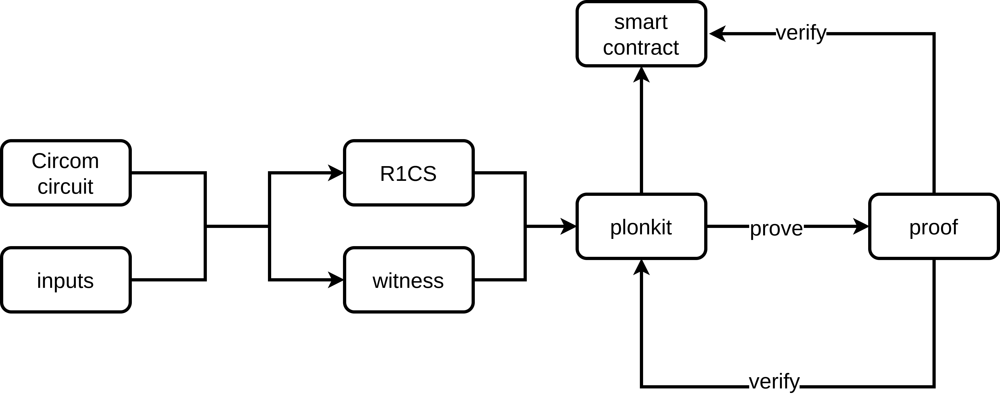

We are proudly to annouce that, FluiDex has received an [ESP grant](https://esp.ethereum.foundation/) from Ethereum Foundation for our [plonkit](https://github.com/fluidex/plonkit).
And now, since this work gets completed, we would like to share more information about it.

## TL;DR
Plonkit is a zkSNARK toolkit to work with [Circom](https://github.com/iden3/circom), a developer-friendly ZKP circuit language, in [PLONK proof system](https://eprint.iacr.org/2019/953.pdf). It allows generating proof, verifying and exporting verifier smart contract.

## The motivation of plonkit
To date, [PLONK](https://eprint.iacr.org/2019/953.pdf) is one of the most performant zk-SNARKS proof systems in terms of proving time and proof size. [As explained by Vitalik Buterin](https://vitalik.ca/general/2019/09/22/plonk.html), by being benefited from “universal and updateable” setup, PLONK is more secure when compared to [Groth16](https://eprint.iacr.org/2016/260.pdf), without introducing much performance loss.

However, it is inefficient to write circuits in pure C++/Rust/… , which requires writing a lot of constraints by hand. By using developer-friendly Circom DSL, people can then write circuits more efficiently and more conveniently. Aiming at bringing PLONK to Circom ecosystem, plonkit is designed. [^1]

## Functionalities
The functionalities of plonkit include:

+ Local Structured-Reference-String (SRS) setup
+ Verification Key Generation (corresponding to a given circuit)
+ Proof Generation
+ Proof Verfication
+ Verifier Smart Contract Generation
+ Proof Aggregation

### Local SRS setup

### Verification Key Generation

### Proof Generation

### Proof Verfication

### Verifier Smart Contract Generation

### Proof Aggregation

## Workflow / Usecase
The diagram below demonstrates a typical workflow of using plonkit:

The ... script is also a good example...

## Acknowledgements
+ Plonkit builds on top of the awesome libraries written by matter-labs:
    * [bellman_ce](https://github.com/matter-labs/bellman)
    * [solidity_plonk_verifier](https://github.com/matter-labs/solidity_plonk_verifier)
    * [recursive_aggregation_circuit](https://github.com/matter-labs/recursive_aggregation_circuit)
+ Plonkit also borrows some "R1CSFile reader" codes from [zkUtil](https://github.com/poma/zkutil).
+ What is more, without the great effort of [Circom](https://github.com/iden3/circom), plonkit won't have the opportunity to bring a friendly ZKP circuit development experience to developers.

Thanks the great work of these teams/individuals!

Try out plonkit [here](https://github.com/fluidex/plonkit) and have fun!

[^1]: By the time of starting plonkit project, Circom/snarkJS didn't support PLONK but [it does now](https://blog.iden3.io/circom-snarkjs-plonk.html). Still, proving in plonkit is more efficient than in snarkJS (plonkit uses Rust and snarkJS uses JS, and their PLONK implementations are different), whereas snarkJS can be run in browsers but plonkit cannot.