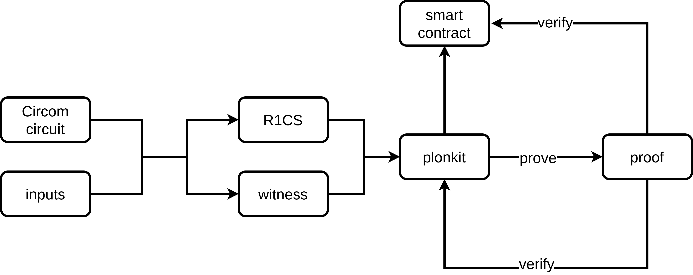

我们很高兴地宣布，FluiDex 的 [plonkit](https://github.com/fluidex/plonkit) 最近得到了以太坊基金会 [ESP grant](https://esp.ethereum.foundation/) 的支持，我们将在这篇文章中介绍我们开发的这款零知识证明工具。

## 简介
Plonkit 是一款配合 [Circom](https://github.com/iden3/circom) 使用的 [PLONK 协议](https://eprint.iacr.org/2019/953.pdf) 零知识证明工具。Circom 是一个开发者能轻易上手的零知识证明电路描述语言。Plonkit 目前支持了：生成 plonk 证明、验证 plonk 证明，以及生成验证合约以在 EVM 中进行验证。

## plonkit 的源起
[PLONK](https://eprint.iacr.org/2019/953.pdf) 目前是性能最好（证明时间、证明体积）的零知识证明协议之一。[V 神在博客中解释道](https://vitalik.ca/general/2019/09/22/plonk.html)，受益于 “universal and updateable” setup， PLONK 比起 [Groth16](https://eprint.iacr.org/2016/260.pdf) 更安全，但性能上又没有太大损失。

但如果使用 C++/Rust/… 来编写零知识证明电路还是太麻烦，因为这需要编写大量的底层的约束。有一个思路可以解决这个问题，即使用 Circom 这门零知识证明电路 DSL 来开发电路。

为了使开发者能轻松地编写电路并使用 plonk 协议，我们开发了 plonkit。[^1]

## plonkit 的功能
Plonkit 的功能包括：

+ Structured-Reference-String (SRS) 的本地生成
+ Verification Key 的生成
+ Proof 的生成
+ Proof 的验证
+ 生成验证合约
+ 证明聚合

### Local SRS setup

想要导出一个 verification key 和生成 proof（具体见下文中的解释），我们需要一个 Structured-Reference-String。在 [test\_poseidon\_plonk.sh](https://github.com/fluidex/plonkit/blob/master/test/test_poseidon_plonk.sh) 中，我们提供了一个实现生成好的 SRS 的下载链接 [^2]。据 [matter-labs](https://github.com/matter-labs/bellman/blob/f551a55d83d2ea604b2dbfe096fd9dcfdaedb189/src/kate_commitment/mod.rs#L1090)，这个是由 [AZTEC 的 ignition setup](https://medium.com/aztec-protocol/aztec-announcing-our-ignition-ceremony-757850264cfe) 解析而来。

为了方便测试，我们添加了本地生成 SRS 的功能。

### Verification Key 的生成

用户可以导出一个电路对应的 verification key。Verification key 需要在验证 proof 时使用。

### Proof 的生成

用户可以生成一个 proof 来证明他知道能满足电路的信息。

### Proof 的验证

Proof 的验证指的是使用电路对应的 verification key 来验证一个 proof。

### 生成验证合约

用户可以使用 plonkit 生成对一个电路的验证合约，这样就可以在 EVM 上验证一个 proof。

### 证明聚合

Plonkit 封装了 [recursive\_aggregation\_circuit](https://github.com/matter-labs/recursive_aggregation_circuit) 以支持证明聚合。核心思想是 [Halo](https://eprint.iacr.org/2019/1021.pdf) 这篇论文。证明聚合使得用户可以将多个证明压缩成一个，达到一个 proof 就能证明多个 proof 的效果。

值得注意的是：
+ 由于以太坊虚拟机只支持 BN_254 一条曲线，所以我们无法像 Halo 中采用循环曲线，而是模拟了 base 域上的元素。
+ 我们并不是循环迭代层层聚合多个 proof，而是将多个 proof 一次性聚合起来，所以是一个深度为 1 的聚合。
+ 我们不直接在电路中验证 pairing，而是将群上的点聚合起来，在智能合约中再进行验证。

## plonkit 的使用流程
下图展示了 plonkit 的使用流程：

[test\_poseidon\_plonk.sh](https://github.com/fluidex/plonkit/blob/master/test/test_poseidon_plonk.sh) 脚本也是个很好的例子。

## 致谢
+ Plonkit 基于 matter-labs 开发的以下几个库:
    * [bellman_ce](https://github.com/matter-labs/bellman)
    * [solidity\_plonk\_verifier](https://github.com/matter-labs/solidity_plonk_verifier)
    * [recursive\_aggregation\_circuit](https://github.com/matter-labs/recursive_aggregation_circuit)
+ Plonkit 的 "R1CSFile reader" 部分源于 [zkUtil](https://github.com/poma/zkutil).
+ 另外，[Circom](https://github.com/iden3/circom) 使得开发者能方便地编写零知识证明电路，这也是 plonkit 的基石之一。

感谢这些伟大的工作。

[^1]: 当我们开始开发 plonkit 时，Circom/snarkJS 还没支持 PLONK（[现已支持](https://blog.iden3.io/circom-snarkjs-plonk.html)）。plonkit 对比起 circom-snarkjs-plonk 会更高效（plonkit 采用 Rust 编写、 snarkJS 采用 JS 编写，而且我们的实现也不尽相同)，但 snarkJS 可以支持在浏览器中运行而 plonkit 暂时不能。
[^2]: 来源：https://github.com/matter-labs/zksync/blob/master/infrastructure/zk/src/run/run.ts#L77
